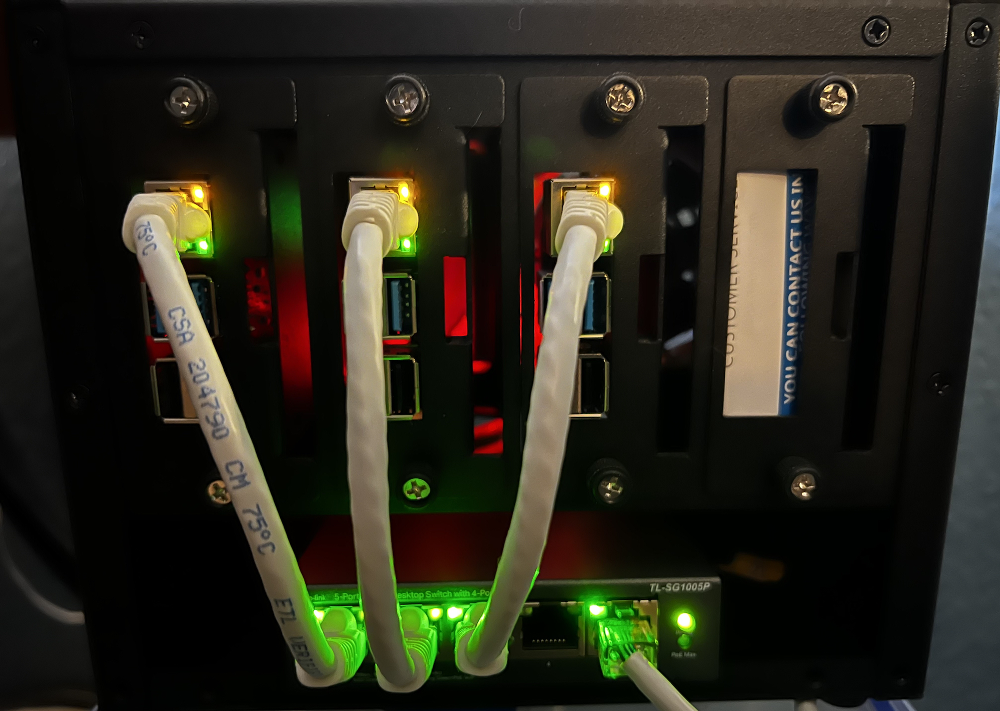

# clusterpi

This document is a point in time reference for setting up a Kubernetes Cluster using Raspberry Pi's.

A few high level notes:

- The following setup requires at least two Raspberry Pi's (one for the control plane and one for a worker node).
  
- The cluster was built using `Raspberry Pi 4 Model B`. In my case the cluster was built with 3 Raspberry Pi's.

- My setup involved using the ethernet connection (for [PoE](https://en.wikipedia.org/wiki/Power_over_Ethernet)). This is not required, however if you are following these steps you may need to adjust the `dhcpcd.conf` settings.

- This cluster is built using `kubeadm`.

The cluster setup documents are broken into three documents:

### General setup for `K8s` nodes

[Initial Setup](initial-setup.md)

### Setup for the `Control Plane` node(s)

[Control Plane Setup](control-plane-setup.md)

### Setup for the `Worker` nodes

[Worker Node Setup](worker-node-setup.md)
